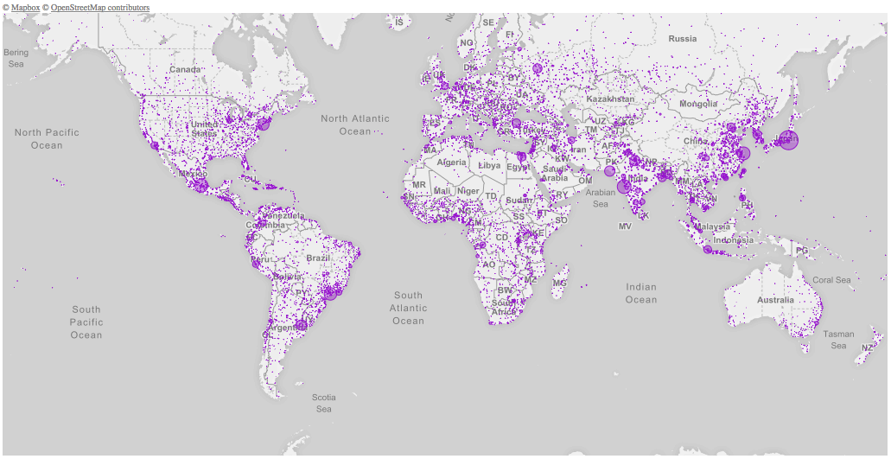

# Population Map

Visual representation of the most populated cities in the world, using the Web Mercator mapping.  

# Data

MAP
+ The map is taken from [mapbox.com](http://mapbox.com)

Data
+ Data is from [simplemaps.com](http://simplemaps.com/data/world-cities)

### Prerequisites

You'll need to run some web server software, such as Apache, to access the local resources.

### Built With

* [P5.js](https://p5js.org) - The JavaScript library used

## License

This project is licensed under the MIT License - see the [LICENSE](https://github.com/adamantino/Population-Map/blob/master/LICENSE) file for details
